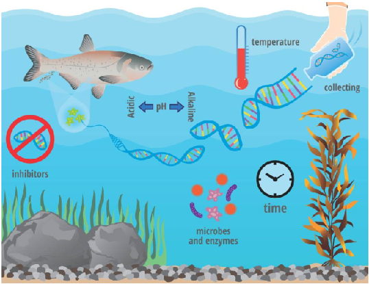
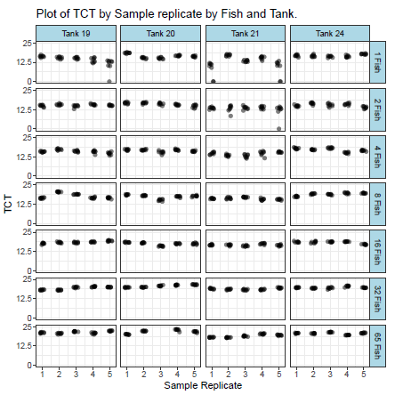
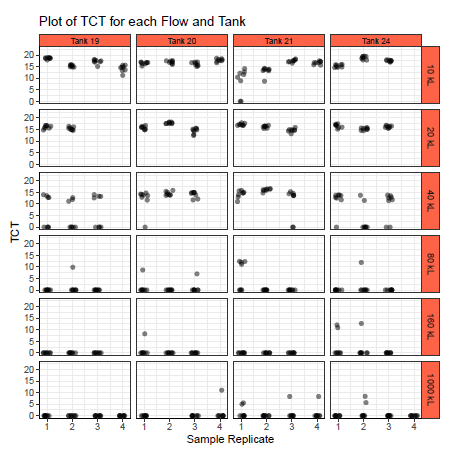
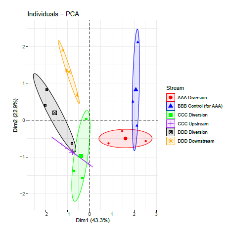
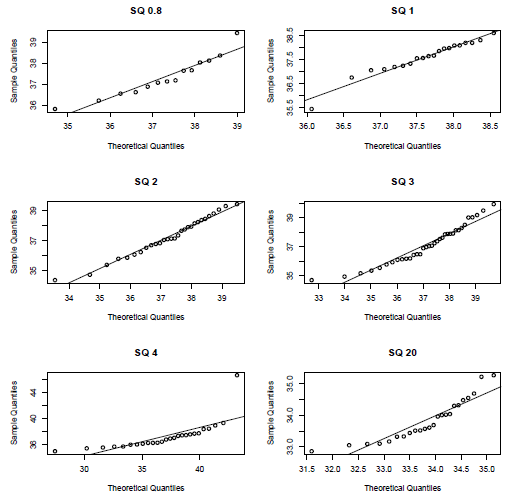

# Eco Fish

This Repository contains code used for the analysis of data and visualizations of Environmental DNA measurements taken from EcoFish Ltd datasets. Much of this analysis was included and done in persuit of my thesis.

To recreate the Thesis, download the Zip file of this repo (top right of the main page of the repo, a green button with the words "code"). Then Select 'download zip'. Next, run 'mainthesisUVIC.tex' (located in the Thesis folder) to create the thesis. Be sure to Unzip the contents of the zip file into a local folder, such as a blank folder on your desktop. The folder called "Data" contains all the required datasets needed to run the R code. Hence, you should set your working directory to this folder.

Image Citation: https://gen-fish.ca/uses-and-limitations-of-environmental-dna-edna-in-fisheries-management/

There are four distinct R scripts, corresponding to differing experiments.

The first set of code is an analysis of a density related experiment.
The second set of code is the analysis of a dilution related experiment.
The third set of code is from the field where we apply covariate analysis.
Finally, we include code for the testing and outlier search for several eDNA related primers.

# Density Experiment 
The goal was to investigate the relationship between
Transformed CT values ('TCT') and Coho salmon 'density' (or the similar measurement
of biomass). CT is the Cycle Threshold and we define TCT=50-CT. The
experiment consisted of manipulating juvenile Coho Salmon densities in treatments of
1, 2, 4, 8, 16, 32, and 65 fish in replicated 10,000L tanks.

# Dilution Experiment

In this experiment, three juvenile Coho were allowed to acclimate to four tanks (tanks 19, 20, 21 and 24) and were subsequently removed. After the Coho were removed, water was allowed to flow out of each tank at a known rate as it was replaced, or diluted, by hatchery water. Measurements were obtained at several intervals of varying levels of flow. Moreover, several control samples were taken from the hatchery kitchen sink and from the hatchery pond.

# Field Study

To study how eDNA analysis can be used to detect Coho in the wild, several field studies were conducted. In particular,
four streams in British Columbia were studied (steams AAA, BBB, CCC and DDD).
Water samples were collected and associated environmental and physical covariates
were recorded. The main fish of interest was Coho Salmon (Oncorhynchus kisutch),
although we also considered Cutthroat Trout (Oncorhynchus clarkii ) and Rainbow
Trout (Oncorhynchus mykiss). EcoFish personnel also took biomass measurements
of each of the species caught using electrofishing.

# Distribution Checks

Analysis of several eDNA related qPCR targets. Checking for consistency and outliers under several distributions.

